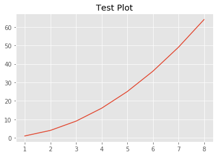

This is a notebook to test the export of Jupyter notebooks into HTML format.

## Import Modules
For this test notebook, I used ```matplotlib``` and ```numpy```. I also set the graphics to be plotted inline in the style of ```ggplot```.  
  
```python
# Import modules
import matplotlib.pyplot as plt
import numpy as np

# Settings
%matplotlib inline
plt.style.use('ggplot')
```

## Create Variables
Next, I created two variables, `x` and `y`.  
  
```python
# Create variables
x = [1, 2, 3, 4, 5, 6, 7, 8]
y = list(np.array(x) ** 2)
```

Here they are, printed out:
```python
# See variables
print("x: " + str(x))
print("y: " + str(y))
```

    x: [1, 2, 3, 4, 5, 6, 7, 8]
    y: [1, 4, 9, 16, 25, 36, 49, 64]
    

## Plot
Finally, I plot them using ```matplotlib```:  
  
```python
# Plot graph
plt.plot(x, y)
plt.title('Test Plot')
plt.show()
```

  
  
## Converting Jupyter Notebooks to Markdown
To convert my notebook into a markdown-ready format, I did the following:  
  
1. Save Jupyter notebook as Markdown (.md).
2. Rename the Markdown file to match the naming convention for the blog.
3. Add the YAML headers for title, subtitle, tags, etc.
4. Move the images used to a dedicated folder and update the file location.
  
---
