  
# Introduction
This week, I'm taking a break from the HDB resale flat pricing model and turning my attention to a hotter topic: mobile phone plans. Some of my colleagues noted an arbitrage opportunity in Singtel's offer for the iPhone XS / XS Max on its Combo 12 plan. The idea was to:  
  
1. Re-contract (or sign a new contract) on Singtel Combo 12 to get a free iPhone XS / XS Max (Singtel now charges \$418++)  
2. Sell the phone for approximately \$1,800  
3. Pay the monthly bill of \$167.90 for Combo 12  (with a Corporate Individual Scheme [CIS] discount of 30%)  
4. Repeat every 6 months
  
The 6-months cycle in table form:
  

<div style="overflow-x:auto; width: 100%;">
<table>
  <thead>
    <tr>
      <th style="text-align: center">Month</th>
      <th style="text-align: center">Income</th>
      <th style="text-align: center">Expenditure</th>
      <th style="text-align: center">Profit</th>
      <th>Remarks</th>
    </tr>
  </thead>
  <tbody>
    <tr>
      <td style="text-align: center">1</td>
      <td style="text-align: center">$1,800</td>
      <td style="text-align: center">$167.90 + $500 + $418 = $1087.90</td>
      <td style="text-align: center">$1,132.10</td>
      <td>Re-contract on Combo 12, get a free iPhone, and sell it</td>
    </tr>
    <tr>
      <td style="text-align: center">2</td>
      <td style="text-align: center">-</td>
      <td style="text-align: center">$167.90</td>
      <td style="text-align: center">-$167.90</td>
      <td>Pay Combo 12 bill</td>
    </tr>
    <tr>
      <td style="text-align: center">3</td>
      <td style="text-align: center">-</td>
      <td style="text-align: center">$167.90</td>
      <td style="text-align: center">-$167.90</td>
      <td>Pay Combo 12 bill</td>
    </tr>
    <tr>
      <td style="text-align: center">4</td>
      <td style="text-align: center">-</td>
      <td style="text-align: center">$167.90</td>
      <td style="text-align: center">-$167.90</td>
      <td>Pay Combo 12 bill</td>
    </tr>
    <tr>
      <td style="text-align: center">5</td>
      <td style="text-align: center">-</td>
      <td style="text-align: center">$167.90</td>
      <td style="text-align: center">-$167.90</td>
      <td>Pay Combo 12 bill</td>
    </tr>
    <tr>
      <td style="text-align: center">6</td>
      <td style="text-align: center">-</td>
      <td style="text-align: center">$167.90</td>
      <td style="text-align: center">-$167.90</td>
      <td>Pay Combo 12 bill</td>
    </tr>
    <tr>
      <td style="text-align: center">Total</td>
      <td style="text-align: center">$1,800</td>
      <td style="text-align: center">$1,927.40</td>
      <td style="text-align: center">-$127.40</td>
      <td>&nbsp;</td>
    </tr>
    <tr>
      <td style="text-align: center">Average</td>
      <td style="text-align: center">$300</td>
      <td style="text-align: center">$321.23</td>
      <td style="text-align: center">-$21.23</td>
      <td>&nbsp;</td>
    </tr>
  </tbody>
</table>
</div>
  
By repeating this *forever*, one can pay an average monthly bill of \$21.23 for Combo 12 perks. Of course, this means that you would be stuck with Singtel for as long as you want to enjoy the benefits, and that you'll eventually need to pay a full 24 months' worth of Combo 12 bills (or terminate your contract) to downgrade your plan. Nevertheless, you stand to gain from lower bills for more services assuming the following conditions hold:  
  
1. Singtel continues to offer the iPhone (the only phone with high resale value) at a low, stable price when signing up for the Combo 12 plan
2. The Combo 12 plan continues to exist, and stays at the same price
3. The resale value of the iPhone remains sufficiently high
4. Apple comes up with a new model every year
5. The CIS discount remains at 30% or better
  
Based on these assumptions, the deal was too risky for me, and I chose not to pursue it. After realising that the Singtel deal turned sour when Singtel increased the price for the iPhone XS on Combo 12 from \$0 to \$418, I was relieved that I hadn't jumped in. A colleague instead suggested that perhaps, I could do some analysis on the best mobile phone plan currently on offer. Hence, in this post, I do exactly that: I explore the determinants of mobile phone plan prices and outline an objective way to choose an ideal phone plan.
  
**Edit:** It just occurred to me how long this post was. Skip to the conclusion or hit *Ctrl+F* and search for **TLDR** (too long, didn't read) to see the main findings.  
  

```python
# Import required modules
from IPython.display import Image  
import matplotlib as mpl
import matplotlib.pyplot as plt
import numpy as np
import pandas as pd
import pydea
import pydotplus
from scipy.spatial import ConvexHull
import seaborn.apionly as sns
from sklearn.linear_model import LinearRegression
from sklearn import tree
from sklearn.tree import DecisionTreeRegressor
from statsmodels.graphics.gofplots import qqplot
from statsmodels.regression.linear_model import OLS, add_constant
import warnings

# Settings
%matplotlib inline
warnings.filterwarnings('ignore')
```

# The Data
I collected mobile phone plan data from the websites of Singtel, Starhub, M1, and Circles.Life. Specifically, I looked at postpaid mobile plans that were not restricted to any age group. I saved the monthly price, free talktime (in minutes), free SMS/MMS, data (in GB), provider, length of contract (in months), and whether or not the plan was a SIM-only plan. There were a total of 48 plans.  
  
Note that the maximum amount of talktime and SMS/MMS were 10,000 minutes and 10,000 respectively as per the Telcos' policies for unlimited talktime and SMS/MMS. The maximum amount of data was assumed to be 1,000 GB, although there was no cap on data in M1's policy. 


```python
# Read data
mobile = pd.read_csv('mobile_plan_data.csv')

# Remove unused columns
mobile = mobile.drop(['perk', 'perk_value'], axis = 1)

# Adjust "unlimited" figures
mobile['talktime'][mobile.talktime == 43200] = 10000
mobile['sms'][mobile.sms == 260000] = 10000
mobile['data'][mobile.data == 999999] = 1000

# Preview
mobile.groupby('provider').head(2)
```


<div style="overflow-x:auto; width: 100%;">
<table border="1" class="dataframe">
  <thead>
    <tr style="text-align: right;">
      <th></th>
      <th>name</th>
      <th>price</th>
      <th>talktime</th>
      <th>sms</th>
      <th>data</th>
      <th>provider</th>
      <th>contract</th>
      <th>sim_only</th>
    </tr>
  </thead>
  <tbody>
    <tr>
      <th>0</th>
      <td>simonly10</td>
      <td>36.05</td>
      <td>150</td>
      <td>500</td>
      <td>12.0</td>
      <td>singtel</td>
      <td>12</td>
      <td>True</td>
    </tr>
    <tr>
      <th>1</th>
      <td>simonly5</td>
      <td>20.00</td>
      <td>150</td>
      <td>500</td>
      <td>6.0</td>
      <td>singtel</td>
      <td>12</td>
      <td>True</td>
    </tr>
    <tr>
      <th>9</th>
      <td>xs_sim12</td>
      <td>24.00</td>
      <td>200</td>
      <td>0</td>
      <td>9.0</td>
      <td>starhub</td>
      <td>12</td>
      <td>True</td>
    </tr>
    <tr>
      <th>10</th>
      <td>s_sim12</td>
      <td>34.00</td>
      <td>400</td>
      <td>0</td>
      <td>11.0</td>
      <td>starhub</td>
      <td>12</td>
      <td>True</td>
    </tr>
    <tr>
      <th>27</th>
      <td>mysim20_12mth</td>
      <td>20.00</td>
      <td>100</td>
      <td>100</td>
      <td>5.0</td>
      <td>m1</td>
      <td>12</td>
      <td>True</td>
    </tr>
    <tr>
      <th>28</th>
      <td>mysim40_12mth</td>
      <td>40.00</td>
      <td>100</td>
      <td>100</td>
      <td>15.0</td>
      <td>m1</td>
      <td>12</td>
      <td>True</td>
    </tr>
    <tr>
      <th>45</th>
      <td>data_baller</td>
      <td>48.00</td>
      <td>100</td>
      <td>0</td>
      <td>26.0</td>
      <td>circles_life</td>
      <td>0</td>
      <td>True</td>
    </tr>
    <tr>
      <th>46</th>
      <td>sweet_spot</td>
      <td>28.00</td>
      <td>100</td>
      <td>0</td>
      <td>6.0</td>
      <td>circles_life</td>
      <td>0</td>
      <td>True</td>
    </tr>
  </tbody>
</table>
</div>


# Exploring the Data
First, we explore the distributions of the various features. We note that most of the features were not normally distributed. Hence, we applied the log transformation to all numeric features, less the contract length, which we convert into a categorical feature.


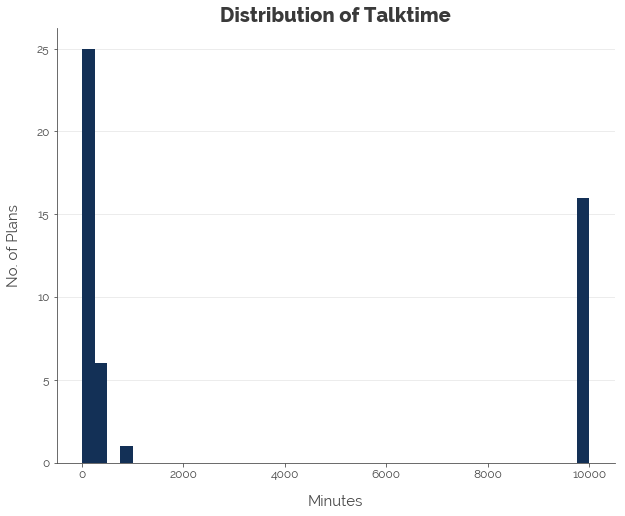


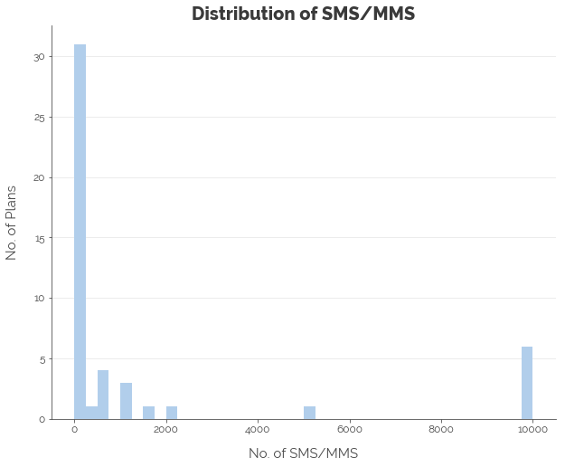


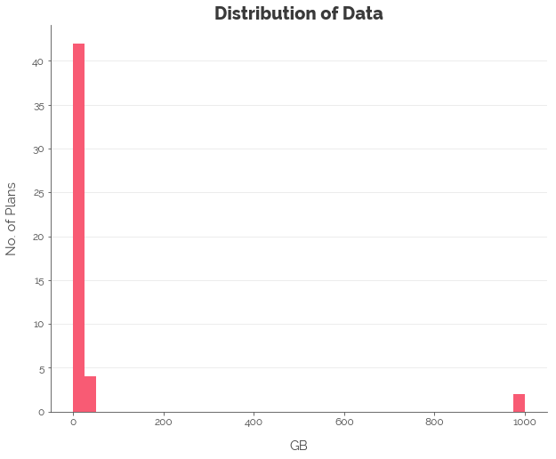


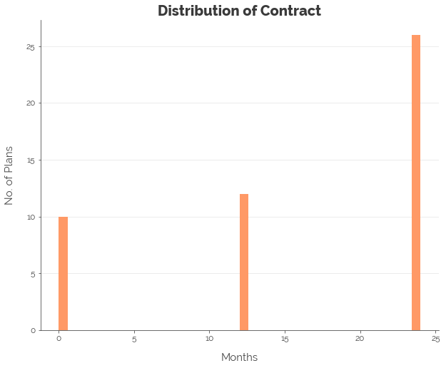


# Linear Regression: Quantifying Linear Relationships
Using Starhub and 24-month contracts as the reference categories for the service provider and contract features respectively, we obtain a regression with an adjusted R-squared value of **76%**. Here are the findings:  
  
1. A **1.00% increase** in free talktime corresponds to a **0.18% increase** in price.
2. A **1.00% increase** in number of free SMS/MMS corresponds to a **0.07% *decrease*** in price (or simply negligible).
3. A **1.00% increase** in data corresponds to a **0.16% increase** in price.
4. A **SIM-only plan** is **0.69% cheaper** than a full mobile plan.
5. M1 and Singtel plans are respectively **0.51% and 0.54% more expensive** than Starhub plans. Starhub plans and Circle.Life plans are competitively priced.
6. There is **no significant difference in price** for plans with 24-month contracts, 12-month contracts, and plans without contracts.


```python
# Configure features to use
feats = ['talktime', 'sms', 'data', 'provider', 'contract', 'sim_only']

# Extract data
y_data = np.log(mobile['price'])
X_data = mobile[feats]

# Convert contract to categorical
X_data.contract = X_data.contract.astype(str)

# Get dummy features
X_data = pd.get_dummies(X_data)

# Take logs
X_data.talktime[X_data.talktime == 0] = 1
X_data.talktime = np.log(X_data.talktime)
X_data.sms[X_data.sms == 0] = 1
X_data.sms = np.log(X_data.sms)
X_data.data = np.log(X_data.data)

# Make starhub and 24-month contracts the reference categories
X_data = X_data.drop(['provider_starhub', 'contract_24'], axis = 1)

# Fit linear regression model
lm_mobile = OLS(y_data, add_constant(X_data.astype(float)))
lm_results = lm_mobile.fit()
print(lm_results.summary())
```

                                OLS Regression Results                            
    ==============================================================================
    Dep. Variable:                  price   R-squared:                       0.812
    Model:                            OLS   Adj. R-squared:                  0.767
    Method:                 Least Squares   F-statistic:                     18.23
    Date:                Sat, 29 Sep 2018   Prob (F-statistic):           3.09e-11
    Time:                        22:38:41   Log-Likelihood:                -9.8884
    No. Observations:                  48   AIC:                             39.78
    Df Residuals:                      38   BIC:                             58.49
    Df Model:                           9                                         
    Covariance Type:            nonrobust                                         
    =========================================================================================
                                coef    std err          t      P>|t|      [0.025      0.975]
    -----------------------------------------------------------------------------------------
    const                     2.7480      0.242     11.350      0.000       2.258       3.238
    talktime                  0.1880      0.033      5.721      0.000       0.121       0.254
    sms                      -0.0629      0.029     -2.153      0.038      -0.122      -0.004
    data                      0.1699      0.044      3.824      0.000       0.080       0.260
    sim_only                 -0.5321      0.194     -2.741      0.009      -0.925      -0.139
    provider_circles_life     0.4138      0.248      1.669      0.103      -0.088       0.916
    provider_m1               0.4632      0.239      1.941      0.060      -0.020       0.946
    provider_singtel          0.4928      0.232      2.121      0.041       0.022       0.963
    contract_0               -0.0903      0.246     -0.367      0.715      -0.588       0.407
    contract_12              -0.2682      0.216     -1.241      0.222      -0.706       0.169
    ==============================================================================
    Omnibus:                        0.378   Durbin-Watson:                   2.141
    Prob(Omnibus):                  0.828   Jarque-Bera (JB):                0.287
    Skew:                           0.181   Prob(JB):                        0.866
    Kurtosis:                       2.885   Cond. No.                         68.0
    ==============================================================================
    
    Warnings:
    [1] Standard Errors assume that the covariance matrix of the errors is correctly specified.
    

A Q-Q plot of the residuals suggests that our data transformations have worked: the assumption of normality of the residuals for our model is satisfied.


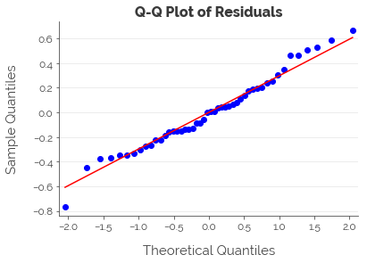


# Decision Trees: Quantifying Non-Linear Relationships
Another way to view the problem is through a non-linear lens. That is, we use a decision tree to (1) establish rules on how to segregate the data and (2) identify the important features. We create a decision tree with a maximum depth of 3 (to avoid overfitting), and obtain the decision tree plotted below, which has an R-squared of **83%**.


```python
# Get data
y_data = mobile['price']
X_data = mobile[feats]
X_data = pd.get_dummies(X_data)

# Decision tree
tree_mobile = DecisionTreeRegressor(max_depth = 3)
tree_mobile.fit(X_data, y_data)

# Plot
dot_data = tree.export_graphviz(
    tree_mobile, feature_names = X_data.columns,
    out_file=None, filled=True,
    rounded=True, precision = 0
)

# Draw graph
graph = pydotplus.graph_from_dot_data(dot_data)  

# NOT RUN - compute adjusted R-squared
yhat = tree_mobile.predict(X_data)
SS_Residual = sum((y_data-yhat)**2)
SS_Total = sum((y_data-np.mean(y_data))**2)
r_squared = 1 - (float(SS_Residual))/SS_Total
adjusted_r_squared = 1 - (1-r_squared)*(len(y_data)-1)/(len(y_data)-X_data.shape[1]-1)
print(adjusted_r_squared)

# Show graph
Image(graph.create_png(), width = 1000)
```

    0.8313318671838421
    


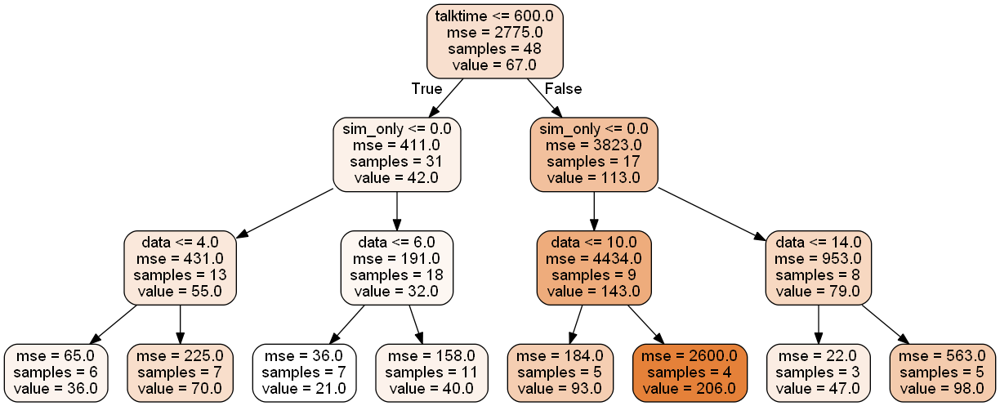


Examining the feature importances, we see that the only three things that matter are (1) talktime, (2) data, and (3) whether or not the plan is SIM-only, in that order.


```python
# Extract coefficients
tree_impt = pd.DataFrame(tree_mobile.feature_importances_)
tree_impt['Feature'] = X_data.columns
tree_impt = tree_impt.rename(columns = {0: 'Importance'})

# View feature importances
tree_impt
```


<div style="overflow-x:auto; width: 100%;">
<table border="1" class="dataframe">
  <thead>
    <tr style="text-align: right;">
      <th></th>
      <th>Importance</th>
      <th>Feature</th>
    </tr>
  </thead>
  <tbody>
    <tr>
      <th>0</th>
      <td>0.482157</td>
      <td>talktime</td>
    </tr>
    <tr>
      <th>1</th>
      <td>0.000000</td>
      <td>sms</td>
    </tr>
    <tr>
      <th>2</th>
      <td>0.333866</td>
      <td>data</td>
    </tr>
    <tr>
      <th>3</th>
      <td>0.000000</td>
      <td>contract</td>
    </tr>
    <tr>
      <th>4</th>
      <td>0.183976</td>
      <td>sim_only</td>
    </tr>
    <tr>
      <th>5</th>
      <td>0.000000</td>
      <td>provider_circles_life</td>
    </tr>
    <tr>
      <th>6</th>
      <td>0.000000</td>
      <td>provider_m1</td>
    </tr>
    <tr>
      <th>7</th>
      <td>0.000000</td>
      <td>provider_singtel</td>
    </tr>
    <tr>
      <th>8</th>
      <td>0.000000</td>
      <td>provider_starhub</td>
    </tr>
  </tbody>
</table>
</div>


# Data Envelopment Analysis: Identifying the Most Worthwhile Plans
Thus far, we've looked at the most important determinants of price. The linear regression and decision tree models generally concur: the amount of talktime, amount of data, and whether the plan was SIM-only were the things that mattered most. Yet, all these insights are not actionable unless we come up with a hierarchy of the most worthwhile mobile plans. Hence, this is what we aim to do next through Data Envelopment Analysis (DEA).  
  
## DEA?
DEA is a way to compare the efficiency of different business units. Although each business unit uses several inputs and outputs, DEA allows us to combine them into a single score. Then, we can use these scores to rank the various business units.
  
In this case, we can think of the outputs as talktime and data, and the sole input as cost. We can easily change the inputs and outputs to whatever is important to us. For example, we could add SMS/MMS as an output if we text a lot, and the contract time as an input because contracts tie us down to a single provider. For now, we calculate the efficiency scores for the mobile plans using talktime per dollar and data (in GB) per dollar.


```python
# Extract data
df = mobile[['price', 'talktime', 'data']]

# Calculate efficiency scores
df['talktime_cost'] = df.talktime / df.price
df['data_cost'] = df.data / df.price
```


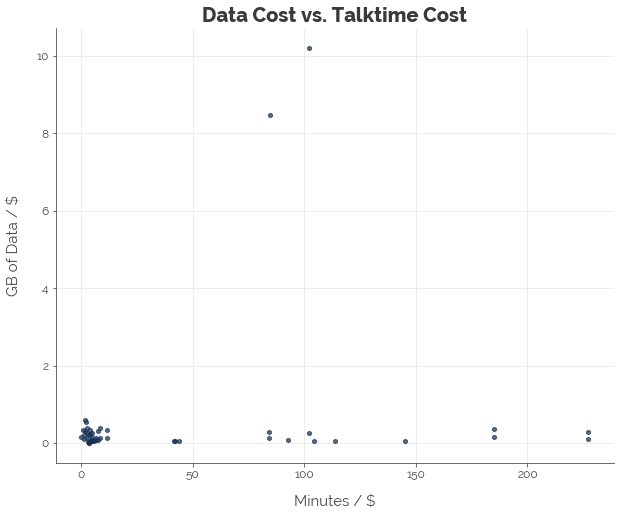


Next, we want to know which plans give us the best value for our money. These plans have either: (1) the most data per dollar, (2) the most talktime per dollar, or some combination of both. To do that, we only need the outermost points of the graph above. Thus, we compute the convex hull and draw a line around the outermost points. This is the efficient frontier.


```python
# Extract efficiencies
eff_data = df[['talktime_cost', 'data_cost']].copy()

# Compute convex hull
hull = ConvexHull(eff_data)
```


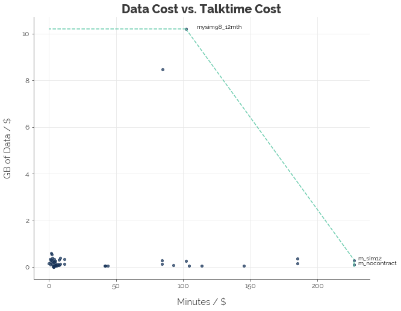


Graphically, we can see which plans are the most efficient. The three "most efficient" plans are:  
  
* M1's mySIM 98 SIM-only 12-month plan that costs \$98.00 (if you prefer data)
* Starhub's "M" SIM-only 12-month plan that costs \$44.00 (if you prefer talktime and you are okay with a contract)
* Starhub's "M" SIM-only no-contract plan that costs \$44.00 (if you prefer talktime and you are okay to pay for freedom with less data)
  
Any plan that lies along the green line (frontier) is considered as good as the three optimal plans. All plans that lie inside the frontier are inferior. Let's put it this way. If data is important to you, there is no better plan than M1's mySIM 98. If talktime is important to you, there is no better plan than Starhub's "M" SIM-only 12-month plan. If you want a balance of both, the tradeoff between talktime and data must follow the relationship indicated by the downward-sloping line.
  
Next, we do the math using the `pyDEA` package to arrive at the same conclusions and tease out more information: we get a ranking of the most efficient mobile plans, evaluated using talktime and data as outputs and price as the sole input.

## All Plans
First, we perform the analysis for all plans. We divide each feature by the respective means (mean normalisation) to prevent the magnitude of each feature from distorting the efficiency scores. Then, we run the DEA algorithm (essentially a linear programme) to get the scores. The top 10 efficient plans are given below. The top 3 plans are the same as the ones derived using the graphical method. However, we also obtain the next best plans.


```python
# Extract relevant data
df = mobile[['price', 'talktime', 'data']]
df = df / df.mean()

# Configure inputs and outputs
df_inputs = df[['price']]
df_outputs = df[['talktime', 'data']]

# Configure problem
mobile_prob = pydea.DEAProblem(df_inputs, df_outputs, returns = 'CRS')

# Solve problem
results = mobile_prob.solve()

# Attach results
dea_data = mobile[['name', 'provider', 'price', 'talktime', 'data']].copy()
dea_data['efficiency'] = round(results['Efficiency'], 3)

# Sort by efficiency
dea_data.sorted = dea_data.sort_values(by = ['efficiency', 'price', 'data'], ascending = [False, True, False])
dea_data.sorted = dea_data.sorted.reset_index(drop = True)

# Save
top_plans = dea_data.sorted.copy()

# View data
dea_data.sorted.head(10)
```


<div style="overflow-x:auto; width: 100%;">
<table border="1" class="dataframe">
  <thead>
    <tr style="text-align: right;">
      <th></th>
      <th>name</th>
      <th>provider</th>
      <th>price</th>
      <th>talktime</th>
      <th>data</th>
      <th>efficiency</th>
    </tr>
  </thead>
  <tbody>
    <tr>
      <th>0</th>
      <td>m_sim12</td>
      <td>starhub</td>
      <td>44.0</td>
      <td>10000</td>
      <td>13.0</td>
      <td>1.000</td>
    </tr>
    <tr>
      <th>1</th>
      <td>m_nocontract</td>
      <td>starhub</td>
      <td>44.0</td>
      <td>10000</td>
      <td>5.0</td>
      <td>1.000</td>
    </tr>
    <tr>
      <th>2</th>
      <td>mysim98_12mth</td>
      <td>m1</td>
      <td>98.0</td>
      <td>10000</td>
      <td>1000.0</td>
      <td>1.000</td>
    </tr>
    <tr>
      <th>3</th>
      <td>mysim_e118</td>
      <td>m1</td>
      <td>118.0</td>
      <td>10000</td>
      <td>1000.0</td>
      <td>0.831</td>
    </tr>
    <tr>
      <th>4</th>
      <td>l_sim12</td>
      <td>starhub</td>
      <td>54.0</td>
      <td>10000</td>
      <td>19.0</td>
      <td>0.821</td>
    </tr>
    <tr>
      <th>5</th>
      <td>l_nocontract</td>
      <td>starhub</td>
      <td>54.0</td>
      <td>10000</td>
      <td>8.0</td>
      <td>0.815</td>
    </tr>
    <tr>
      <th>6</th>
      <td>combo3</td>
      <td>singtel</td>
      <td>68.9</td>
      <td>10000</td>
      <td>3.0</td>
      <td>0.639</td>
    </tr>
    <tr>
      <th>7</th>
      <td>m</td>
      <td>starhub</td>
      <td>88.0</td>
      <td>10000</td>
      <td>5.0</td>
      <td>0.500</td>
    </tr>
    <tr>
      <th>8</th>
      <td>combo6</td>
      <td>singtel</td>
      <td>95.9</td>
      <td>10000</td>
      <td>6.0</td>
      <td>0.459</td>
    </tr>
    <tr>
      <th>9</th>
      <td>mysim98</td>
      <td>m1</td>
      <td>98.0</td>
      <td>10000</td>
      <td>25.0</td>
      <td>0.456</td>
    </tr>
  </tbody>
</table>
</div>


## All Plans, Less M1's Unlimited Data Plans
M1's data plans looked good because I set a high cap on data of 1,000 GB. However, lowering the cap will not change the results: M1's plans offer good value. And because they offer good value, they are also pretty expensive. For most of us who would not pay that much for unlimited data, I perform the analysis on all plans less M1's two unlimited data plans.


```python
# Extract relevant data
df = mobile[['price', 'talktime', 'data']]
df = df.drop([30, 38], axis = 0)

# Graph data
df_graph = df.copy()
df_graph['talktime_cost'] = df_graph.talktime / df_graph.price
df_graph['data_cost'] = df_graph.data / df_graph.price

# Mean normalisation
df = df / df.mean()

# Configure inputs and outputs
df_inputs = df[['price']]
df_outputs = df[['talktime', 'data']]

# Configure problem
mobile_prob = pydea.DEAProblem(df_inputs, df_outputs, returns = 'CRS')

# Solve problem
results = mobile_prob.solve()

# Attach results
dea_data = mobile[['name', 'provider', 'price', 'talktime', 'data']].copy()
dea_data['efficiency'] = round(results['Efficiency'], 3)

# Sort by efficiency
dea_data.sorted = dea_data.sort_values(by = ['efficiency', 'price', 'data'], ascending = [False, True, False])
dea_data.sorted = dea_data.sorted.reset_index(drop = True)

# View data
dea_data.sorted.head(10)
```


<div style="overflow-x:auto; width: 100%;">
<table border="1" class="dataframe">
  <thead>
    <tr style="text-align: right;">
      <th></th>
      <th>name</th>
      <th>provider</th>
      <th>price</th>
      <th>talktime</th>
      <th>data</th>
      <th>efficiency</th>
    </tr>
  </thead>
  <tbody>
    <tr>
      <th>0</th>
      <td>m_sim12</td>
      <td>starhub</td>
      <td>44.0</td>
      <td>10000</td>
      <td>13.0</td>
      <td>1.000</td>
    </tr>
    <tr>
      <th>1</th>
      <td>m_nocontract</td>
      <td>starhub</td>
      <td>44.0</td>
      <td>10000</td>
      <td>5.0</td>
      <td>1.000</td>
    </tr>
    <tr>
      <th>2</th>
      <td>mysim50_12mth</td>
      <td>m1</td>
      <td>50.0</td>
      <td>100</td>
      <td>30.0</td>
      <td>1.000</td>
    </tr>
    <tr>
      <th>3</th>
      <td>l_sim12</td>
      <td>starhub</td>
      <td>54.0</td>
      <td>10000</td>
      <td>19.0</td>
      <td>0.999</td>
    </tr>
    <tr>
      <th>4</th>
      <td>data_baller</td>
      <td>circles_life</td>
      <td>48.0</td>
      <td>100</td>
      <td>26.0</td>
      <td>0.903</td>
    </tr>
    <tr>
      <th>5</th>
      <td>l_nocontract</td>
      <td>starhub</td>
      <td>54.0</td>
      <td>10000</td>
      <td>8.0</td>
      <td>0.815</td>
    </tr>
    <tr>
      <th>6</th>
      <td>mysim98</td>
      <td>m1</td>
      <td>98.0</td>
      <td>10000</td>
      <td>25.0</td>
      <td>0.652</td>
    </tr>
    <tr>
      <th>7</th>
      <td>xl_sim12</td>
      <td>starhub</td>
      <td>119.0</td>
      <td>10000</td>
      <td>33.0</td>
      <td>0.649</td>
    </tr>
    <tr>
      <th>8</th>
      <td>xs_sim12</td>
      <td>starhub</td>
      <td>24.0</td>
      <td>200</td>
      <td>9.0</td>
      <td>0.641</td>
    </tr>
    <tr>
      <th>9</th>
      <td>combo3</td>
      <td>singtel</td>
      <td>68.9</td>
      <td>10000</td>
      <td>3.0</td>
      <td>0.639</td>
    </tr>
  </tbody>
</table>
</div>


Plotting the graph:


```python
# Extract efficiencies
eff_data = df_graph[['talktime_cost', 'data_cost']].copy()

# Compute convex hull
hull = ConvexHull(eff_data)
```


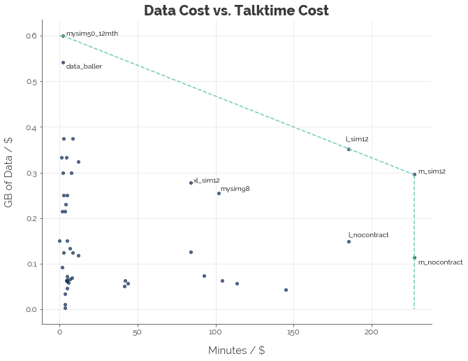


The first thing we notice is the concentration of points on the far left of the graph. That's because the Telcos are competing primarily using data bundles. Along that dimension, M1 takes the top spot with its mySim 50 plan, which offers a whopping 30 GB. The second thing we notice is that Starhub is out there with 4 plans (M and L, 12-month and no-contract) owning the market segment focused on talktime - it has no close competitor.  
  
I've added labels for several other points that do not lie on the efficient frontier. Two of them are worth noting: Starhub's XL SIM-only plan and M1's mySim 98. I highlighted them because they offer a good balance between data and talktime.

## Bundle Plans
I don't actually know what the alternative to SIM-only plans are called. Hence, I'll just call them bundle plans since the underlying marketing tactic is essentially bundling (of phones and mobile services).


```python
# Extract relevant data
df = mobile[['price', 'talktime', 'data']][mobile.sim_only == False]
df = df / df.mean()

# Configure inputs and outputs
df_inputs = df[['price']]
df_outputs = df[['talktime', 'data']]

# Data for graphics
df_graph = mobile[['price', 'talktime', 'data']][mobile.sim_only == False]
df_graph['talktime_cost'] = df_graph.talktime / df_graph.price
df_graph['data_cost'] = df_graph.data / df_graph.price

# Configure problem
mobile_prob = pydea.DEAProblem(df_inputs, df_outputs, returns = 'CRS')

# Solve problem
results = mobile_prob.solve()

# Attach results
dea_data = mobile[['name', 'provider', 'price', 'talktime', 'data']].copy()
dea_data['efficiency'] = round(results['Efficiency'], 3)

# Sort by efficiency
dea_data.sorted = dea_data.sort_values(by = ['efficiency', 'price', 'data'], ascending = [False, True, False])
dea_data.sorted = dea_data.sorted.reset_index(drop = True)

# View data
dea_data.sorted.head(5)
```


<div style="overflow-x:auto; width: 100%;">
<table border="1" class="dataframe">
  <thead>
    <tr style="text-align: right;">
      <th></th>
      <th>name</th>
      <th>provider</th>
      <th>price</th>
      <th>talktime</th>
      <th>data</th>
      <th>efficiency</th>
    </tr>
  </thead>
  <tbody>
    <tr>
      <th>0</th>
      <td>combo3</td>
      <td>singtel</td>
      <td>68.9</td>
      <td>10000</td>
      <td>3.0</td>
      <td>1.000</td>
    </tr>
    <tr>
      <th>1</th>
      <td>mysim_e118</td>
      <td>m1</td>
      <td>118.0</td>
      <td>10000</td>
      <td>1000.0</td>
      <td>1.000</td>
    </tr>
    <tr>
      <th>2</th>
      <td>m</td>
      <td>starhub</td>
      <td>88.0</td>
      <td>10000</td>
      <td>5.0</td>
      <td>0.784</td>
    </tr>
    <tr>
      <th>3</th>
      <td>combo6</td>
      <td>singtel</td>
      <td>95.9</td>
      <td>10000</td>
      <td>6.0</td>
      <td>0.720</td>
    </tr>
    <tr>
      <th>4</th>
      <td>l</td>
      <td>starhub</td>
      <td>108.0</td>
      <td>10000</td>
      <td>8.0</td>
      <td>0.640</td>
    </tr>
  </tbody>
</table>
</div>


Once again, M1 is spoiling the market with a beast of a plan: mySim(e) 118 with unlimited data.


```python
# Extract efficiencies
eff_data = df_graph[['talktime_cost', 'data_cost']].copy()

# Compute convex hull
hull = ConvexHull(eff_data)
```


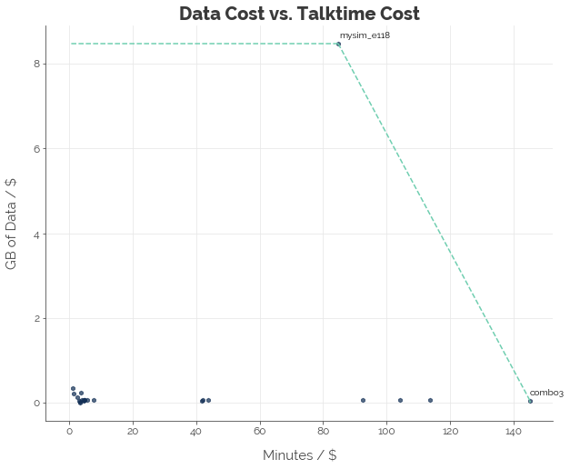


## Bundle Plans, Less M1's Unlimited Data Plan
Removing M1's unlimited data plan, we get a better picture of how the rest of the bundle plans fare: 


```python
# Extract relevant data
df = mobile[['price', 'talktime', 'data']][mobile.sim_only == False]
df = df.drop(38, axis = 0)
df = df / df.mean()

# Configure inputs and outputs
df_inputs = df[['price']]
df_outputs = df[['talktime', 'data']]

# Data for graphics
df_graph = mobile[['price', 'talktime', 'data']][mobile.sim_only == False]
df_graph = df_graph.drop(38, axis = 0)
df_graph['talktime_cost'] = df_graph.talktime / df_graph.price
df_graph['data_cost'] = df_graph.data / df_graph.price

# Configure problem
mobile_prob = pydea.DEAProblem(df_inputs, df_outputs, returns = 'CRS')

# Solve problem
results = mobile_prob.solve()

# Attach results
dea_data = mobile[['name', 'provider', 'price', 'talktime', 'data']].copy()
dea_data['efficiency'] = round(results['Efficiency'], 3)

# Sort by efficiency
dea_data.sorted = dea_data.sort_values(by = ['efficiency', 'price', 'data'], ascending = [False, True, False])
dea_data.sorted = dea_data.sorted.reset_index(drop = True)

# View data
dea_data.sorted.head(7)
```


<div style="overflow-x:auto; width: 100%;">
<table border="1" class="dataframe">
  <thead>
    <tr style="text-align: right;">
      <th></th>
      <th>name</th>
      <th>provider</th>
      <th>price</th>
      <th>talktime</th>
      <th>data</th>
      <th>efficiency</th>
    </tr>
  </thead>
  <tbody>
    <tr>
      <th>0</th>
      <td>combo3</td>
      <td>singtel</td>
      <td>68.9</td>
      <td>10000</td>
      <td>3.0</td>
      <td>1.000</td>
    </tr>
    <tr>
      <th>1</th>
      <td>mysim_e90</td>
      <td>m1</td>
      <td>90.0</td>
      <td>100</td>
      <td>30.0</td>
      <td>1.000</td>
    </tr>
    <tr>
      <th>2</th>
      <td>m</td>
      <td>starhub</td>
      <td>88.0</td>
      <td>10000</td>
      <td>5.0</td>
      <td>0.851</td>
    </tr>
    <tr>
      <th>3</th>
      <td>combo6</td>
      <td>singtel</td>
      <td>95.9</td>
      <td>10000</td>
      <td>6.0</td>
      <td>0.812</td>
    </tr>
    <tr>
      <th>4</th>
      <td>l</td>
      <td>starhub</td>
      <td>108.0</td>
      <td>10000</td>
      <td>8.0</td>
      <td>0.776</td>
    </tr>
    <tr>
      <th>5</th>
      <td>comboxo</td>
      <td>singtel</td>
      <td>78.0</td>
      <td>300</td>
      <td>18.0</td>
      <td>0.711</td>
    </tr>
    <tr>
      <th>6</th>
      <td>mysim_e70</td>
      <td>m1</td>
      <td>70.0</td>
      <td>100</td>
      <td>15.0</td>
      <td>0.647</td>
    </tr>
  </tbody>
</table>
</div>


```python
# Extract efficiencies
eff_data = df_graph[['talktime_cost', 'data_cost']].copy()

# Compute convex hull
hull = ConvexHull(eff_data)
```


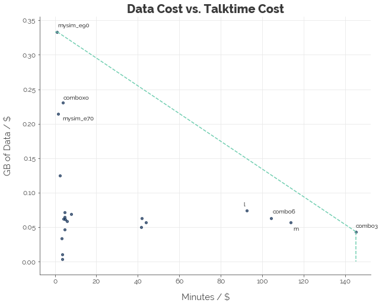


We see that M1 offers 2 of the most value-for-money data plans, while Singtel offers the best talktime plan. Although Starhub provides the most value in the SIM-only market for talktime, Singtel takes top spot for bundle plans.

# Conclusion [TLDR]
In this post, I used linear regression to quantify the relationship between mobile plan parameters and their price, a decision tree to identify the most important parameters, and data envelopment analysis (DEA) to compute the most efficient plans for data and talktime, and the optimal tradeoff between these two priorities.  
  
As you can see from the variety of plans, the offering is extremely polarised. Plans deliver value either in terms of talktime or data. Thus, you only need to know your priority and your budget to make a good decision.  
  
## Data
If your priority is data, you only need to calculate the most efficient data plans based on data per dollar. Here are the top 5 from the SIM-only and bundle categories. M1 has an excellent offering in both categories.


```python
# Extract top data plans
data_plans = mobile.copy()

# Calculate efficiency
data_plans['data_cost'] = data_plans.data / data_plans.price

# Sort plans
data_plans = data_plans.sort_values(by = ['sim_only', 'data_cost'], ascending = [False, False]).groupby('sim_only').head(5)
data_plans = data_plans.reset_index(drop = True)

# View
data_plans
```


<div style="overflow-x:auto; width: 100%;">
<table border="1" class="dataframe">
  <thead>
    <tr style="text-align: right;">
      <th></th>
      <th>name</th>
      <th>price</th>
      <th>talktime</th>
      <th>sms</th>
      <th>data</th>
      <th>provider</th>
      <th>contract</th>
      <th>sim_only</th>
      <th>data_cost</th>
    </tr>
  </thead>
  <tbody>
    <tr>
      <th>0</th>
      <td>mysim98_12mth</td>
      <td>98.0</td>
      <td>10000</td>
      <td>10000</td>
      <td>1000.0</td>
      <td>m1</td>
      <td>12</td>
      <td>True</td>
      <td>10.204082</td>
    </tr>
    <tr>
      <th>1</th>
      <td>mysim50_12mth</td>
      <td>50.0</td>
      <td>100</td>
      <td>100</td>
      <td>30.0</td>
      <td>m1</td>
      <td>12</td>
      <td>True</td>
      <td>0.600000</td>
    </tr>
    <tr>
      <th>2</th>
      <td>data_baller</td>
      <td>48.0</td>
      <td>100</td>
      <td>0</td>
      <td>26.0</td>
      <td>circles_life</td>
      <td>0</td>
      <td>True</td>
      <td>0.541667</td>
    </tr>
    <tr>
      <th>3</th>
      <td>xs_sim12</td>
      <td>24.0</td>
      <td>200</td>
      <td>0</td>
      <td>9.0</td>
      <td>starhub</td>
      <td>12</td>
      <td>True</td>
      <td>0.375000</td>
    </tr>
    <tr>
      <th>4</th>
      <td>mysim40_12mth</td>
      <td>40.0</td>
      <td>100</td>
      <td>100</td>
      <td>15.0</td>
      <td>m1</td>
      <td>12</td>
      <td>True</td>
      <td>0.375000</td>
    </tr>
    <tr>
      <th>5</th>
      <td>mysim_e118</td>
      <td>118.0</td>
      <td>10000</td>
      <td>10000</td>
      <td>1000.0</td>
      <td>m1</td>
      <td>24</td>
      <td>False</td>
      <td>8.474576</td>
    </tr>
    <tr>
      <th>6</th>
      <td>mysim_e90</td>
      <td>90.0</td>
      <td>100</td>
      <td>100</td>
      <td>30.0</td>
      <td>m1</td>
      <td>24</td>
      <td>False</td>
      <td>0.333333</td>
    </tr>
    <tr>
      <th>7</th>
      <td>comboxo</td>
      <td>78.0</td>
      <td>300</td>
      <td>300</td>
      <td>18.0</td>
      <td>singtel</td>
      <td>24</td>
      <td>False</td>
      <td>0.230769</td>
    </tr>
    <tr>
      <th>8</th>
      <td>mysim_e70</td>
      <td>70.0</td>
      <td>100</td>
      <td>100</td>
      <td>15.0</td>
      <td>m1</td>
      <td>24</td>
      <td>False</td>
      <td>0.214286</td>
    </tr>
    <tr>
      <th>9</th>
      <td>mysim_e40</td>
      <td>40.0</td>
      <td>100</td>
      <td>100</td>
      <td>5.0</td>
      <td>m1</td>
      <td>24</td>
      <td>False</td>
      <td>0.125000</td>
    </tr>
  </tbody>
</table>
</div>


## Talktime
If talktime is your priority, the decision is easy. There are many plans with unlimited talktime. It is therefore only a matter of price, and Starhub provides the best offers.


```python
# Extract top plans
tt_plans = mobile.iloc[[5, 6, 8, 9, 11, 12, 13, 16, 17, 24, 25, 29, 30, 34, 36, 37, 38, 45], ].copy()
tt_plans = mobile.copy()

# Calculate efficiency
tt_plans['talktime_cost'] = tt_plans.talktime / tt_plans.price

# Sort plans
tt_plans = tt_plans.sort_values(by = ['sim_only', 'talktime_cost'], ascending = [False, False]).groupby('sim_only').head(5)
tt_plans = tt_plans.reset_index(drop = True)

# View
tt_plans
```


<div style="overflow-x:auto; width: 100%;">
<table border="1" class="dataframe">
  <thead>
    <tr style="text-align: right;">
      <th></th>
      <th>name</th>
      <th>price</th>
      <th>talktime</th>
      <th>sms</th>
      <th>data</th>
      <th>provider</th>
      <th>contract</th>
      <th>sim_only</th>
      <th>talktime_cost</th>
    </tr>
  </thead>
  <tbody>
    <tr>
      <th>0</th>
      <td>m_sim12</td>
      <td>44.0</td>
      <td>10000</td>
      <td>0</td>
      <td>13.0</td>
      <td>starhub</td>
      <td>12</td>
      <td>True</td>
      <td>227.272727</td>
    </tr>
    <tr>
      <th>1</th>
      <td>m_nocontract</td>
      <td>44.0</td>
      <td>10000</td>
      <td>0</td>
      <td>5.0</td>
      <td>starhub</td>
      <td>0</td>
      <td>True</td>
      <td>227.272727</td>
    </tr>
    <tr>
      <th>2</th>
      <td>l_sim12</td>
      <td>54.0</td>
      <td>10000</td>
      <td>0</td>
      <td>19.0</td>
      <td>starhub</td>
      <td>12</td>
      <td>True</td>
      <td>185.185185</td>
    </tr>
    <tr>
      <th>3</th>
      <td>l_nocontract</td>
      <td>54.0</td>
      <td>10000</td>
      <td>0</td>
      <td>8.0</td>
      <td>starhub</td>
      <td>0</td>
      <td>True</td>
      <td>185.185185</td>
    </tr>
    <tr>
      <th>4</th>
      <td>mysim98_12mth</td>
      <td>98.0</td>
      <td>10000</td>
      <td>10000</td>
      <td>1000.0</td>
      <td>m1</td>
      <td>12</td>
      <td>True</td>
      <td>102.040816</td>
    </tr>
    <tr>
      <th>5</th>
      <td>combo3</td>
      <td>68.9</td>
      <td>10000</td>
      <td>10000</td>
      <td>3.0</td>
      <td>singtel</td>
      <td>24</td>
      <td>False</td>
      <td>145.137881</td>
    </tr>
    <tr>
      <th>6</th>
      <td>m</td>
      <td>88.0</td>
      <td>10000</td>
      <td>0</td>
      <td>5.0</td>
      <td>starhub</td>
      <td>24</td>
      <td>False</td>
      <td>113.636364</td>
    </tr>
    <tr>
      <th>7</th>
      <td>combo6</td>
      <td>95.9</td>
      <td>10000</td>
      <td>10000</td>
      <td>6.0</td>
      <td>singtel</td>
      <td>24</td>
      <td>False</td>
      <td>104.275287</td>
    </tr>
    <tr>
      <th>8</th>
      <td>l</td>
      <td>108.0</td>
      <td>10000</td>
      <td>0</td>
      <td>8.0</td>
      <td>starhub</td>
      <td>24</td>
      <td>False</td>
      <td>92.592593</td>
    </tr>
    <tr>
      <th>9</th>
      <td>mysim_e118</td>
      <td>118.0</td>
      <td>10000</td>
      <td>10000</td>
      <td>1000.0</td>
      <td>m1</td>
      <td>24</td>
      <td>False</td>
      <td>84.745763</td>
    </tr>
  </tbody>
</table>
</div>


## Data and Talktime
If it is a combination of data and talktime you seek, use the table below to pick a plan. These are the most efficient plans on offer.


```python
# Extract sim_only
names = mobile.sim_only.copy()
names.index = mobile.name

# Map sim_only
top_plans['sim_only'] = top_plans.name.map(names)

# Sort plans
top_plans = top_plans.sort_values(by = 'efficiency', ascending = False)
top_plans = top_plans.reset_index(drop = True)

# View table
top_plans.head(20)
```


<div style="overflow-x:auto; width: 100%;">
<table border="1" class="dataframe">
  <thead>
    <tr style="text-align: right;">
      <th></th>
      <th>name</th>
      <th>provider</th>
      <th>price</th>
      <th>talktime</th>
      <th>data</th>
      <th>efficiency</th>
      <th>sim_only</th>
    </tr>
  </thead>
  <tbody>
    <tr>
      <th>0</th>
      <td>m_sim12</td>
      <td>starhub</td>
      <td>44.0</td>
      <td>10000</td>
      <td>13.0</td>
      <td>1.000</td>
      <td>True</td>
    </tr>
    <tr>
      <th>1</th>
      <td>m_nocontract</td>
      <td>starhub</td>
      <td>44.0</td>
      <td>10000</td>
      <td>5.0</td>
      <td>1.000</td>
      <td>True</td>
    </tr>
    <tr>
      <th>2</th>
      <td>mysim98_12mth</td>
      <td>m1</td>
      <td>98.0</td>
      <td>10000</td>
      <td>1000.0</td>
      <td>1.000</td>
      <td>True</td>
    </tr>
    <tr>
      <th>3</th>
      <td>mysim_e118</td>
      <td>m1</td>
      <td>118.0</td>
      <td>10000</td>
      <td>1000.0</td>
      <td>0.831</td>
      <td>False</td>
    </tr>
    <tr>
      <th>4</th>
      <td>l_sim12</td>
      <td>starhub</td>
      <td>54.0</td>
      <td>10000</td>
      <td>19.0</td>
      <td>0.821</td>
      <td>True</td>
    </tr>
    <tr>
      <th>5</th>
      <td>l_nocontract</td>
      <td>starhub</td>
      <td>54.0</td>
      <td>10000</td>
      <td>8.0</td>
      <td>0.815</td>
      <td>True</td>
    </tr>
    <tr>
      <th>6</th>
      <td>combo3</td>
      <td>singtel</td>
      <td>68.9</td>
      <td>10000</td>
      <td>3.0</td>
      <td>0.639</td>
      <td>False</td>
    </tr>
    <tr>
      <th>7</th>
      <td>m</td>
      <td>starhub</td>
      <td>88.0</td>
      <td>10000</td>
      <td>5.0</td>
      <td>0.500</td>
      <td>False</td>
    </tr>
    <tr>
      <th>8</th>
      <td>combo6</td>
      <td>singtel</td>
      <td>95.9</td>
      <td>10000</td>
      <td>6.0</td>
      <td>0.459</td>
      <td>False</td>
    </tr>
    <tr>
      <th>9</th>
      <td>mysim98</td>
      <td>m1</td>
      <td>98.0</td>
      <td>10000</td>
      <td>25.0</td>
      <td>0.456</td>
      <td>True</td>
    </tr>
    <tr>
      <th>10</th>
      <td>l</td>
      <td>starhub</td>
      <td>108.0</td>
      <td>10000</td>
      <td>8.0</td>
      <td>0.407</td>
      <td>False</td>
    </tr>
    <tr>
      <th>11</th>
      <td>xl_sim12</td>
      <td>starhub</td>
      <td>119.0</td>
      <td>10000</td>
      <td>33.0</td>
      <td>0.379</td>
      <td>True</td>
    </tr>
    <tr>
      <th>12</th>
      <td>xl_nocontract</td>
      <td>starhub</td>
      <td>119.0</td>
      <td>10000</td>
      <td>15.0</td>
      <td>0.371</td>
      <td>True</td>
    </tr>
    <tr>
      <th>13</th>
      <td>max_plus</td>
      <td>m1</td>
      <td>228.0</td>
      <td>10000</td>
      <td>13.0</td>
      <td>0.193</td>
      <td>False</td>
    </tr>
    <tr>
      <th>14</th>
      <td>xl</td>
      <td>starhub</td>
      <td>238.0</td>
      <td>10000</td>
      <td>15.0</td>
      <td>0.185</td>
      <td>False</td>
    </tr>
    <tr>
      <th>15</th>
      <td>combo12</td>
      <td>singtel</td>
      <td>239.9</td>
      <td>10000</td>
      <td>12.0</td>
      <td>0.183</td>
      <td>False</td>
    </tr>
    <tr>
      <th>16</th>
      <td>s_sim12</td>
      <td>starhub</td>
      <td>34.0</td>
      <td>400</td>
      <td>11.0</td>
      <td>0.069</td>
      <td>True</td>
    </tr>
    <tr>
      <th>17</th>
      <td>mysim50_12mth</td>
      <td>m1</td>
      <td>50.0</td>
      <td>100</td>
      <td>30.0</td>
      <td>0.059</td>
      <td>True</td>
    </tr>
    <tr>
      <th>18</th>
      <td>xs_sim12</td>
      <td>starhub</td>
      <td>24.0</td>
      <td>200</td>
      <td>9.0</td>
      <td>0.057</td>
      <td>True</td>
    </tr>
    <tr>
      <th>19</th>
      <td>s_nocontract</td>
      <td>starhub</td>
      <td>34.0</td>
      <td>400</td>
      <td>4.0</td>
      <td>0.057</td>
      <td>True</td>
    </tr>
  </tbody>
</table>
</div>
  
  
---
Click [here](http://nbviewer.jupyter.org/github/chrischow/dataandstuff/blob/37f9a9598b6a9ec115be1924127fc7a824ca1e8e/notebooks/2018-09-29-singapores-best-mobile-phone-plans.ipynb){:target="_blank"} for the full Jupyter notebook.
  
Credits for images: [YouTube / Justin Tse](https://www.youtube.com/channel/UCaP1PNnr055fOt89JPry51w)  
Credits for data: [Singtel](https://www.singtel.com/); [M1](https://www.m1.com.sg/home); [Starhub](http://www.starhub.com/personal.html); [Circles.Life](https://pages.circles.life/)
