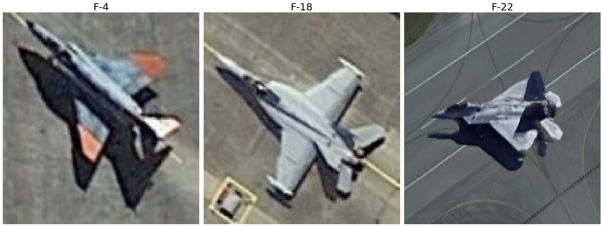
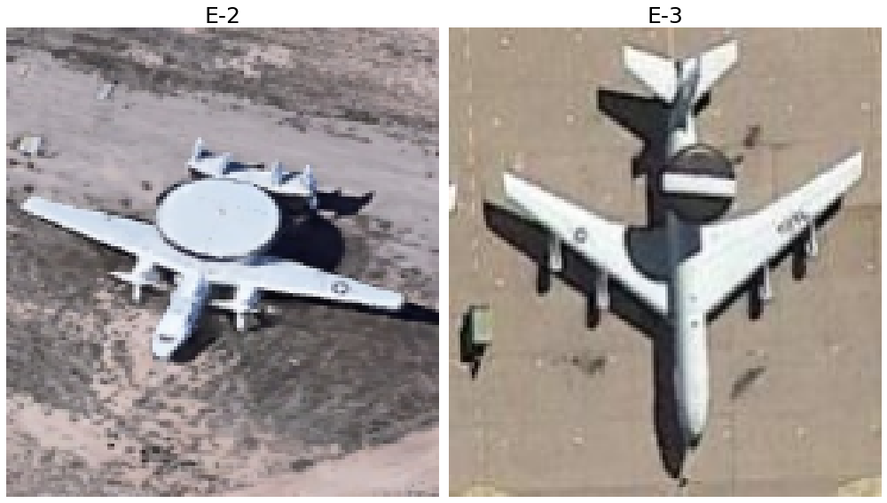
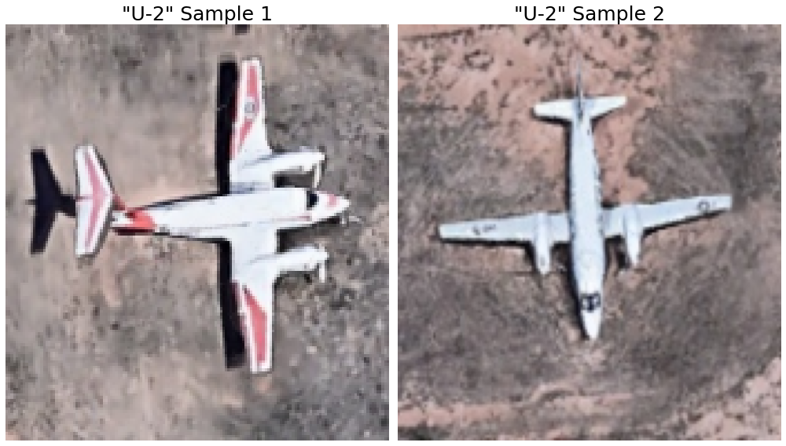
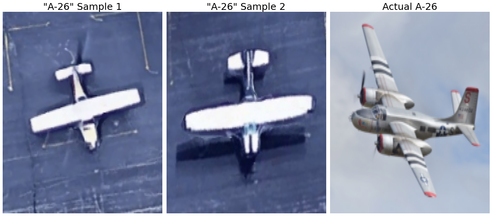
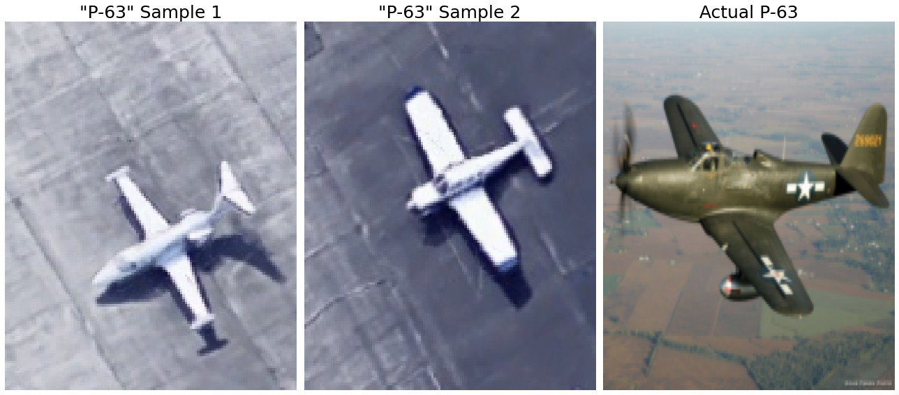
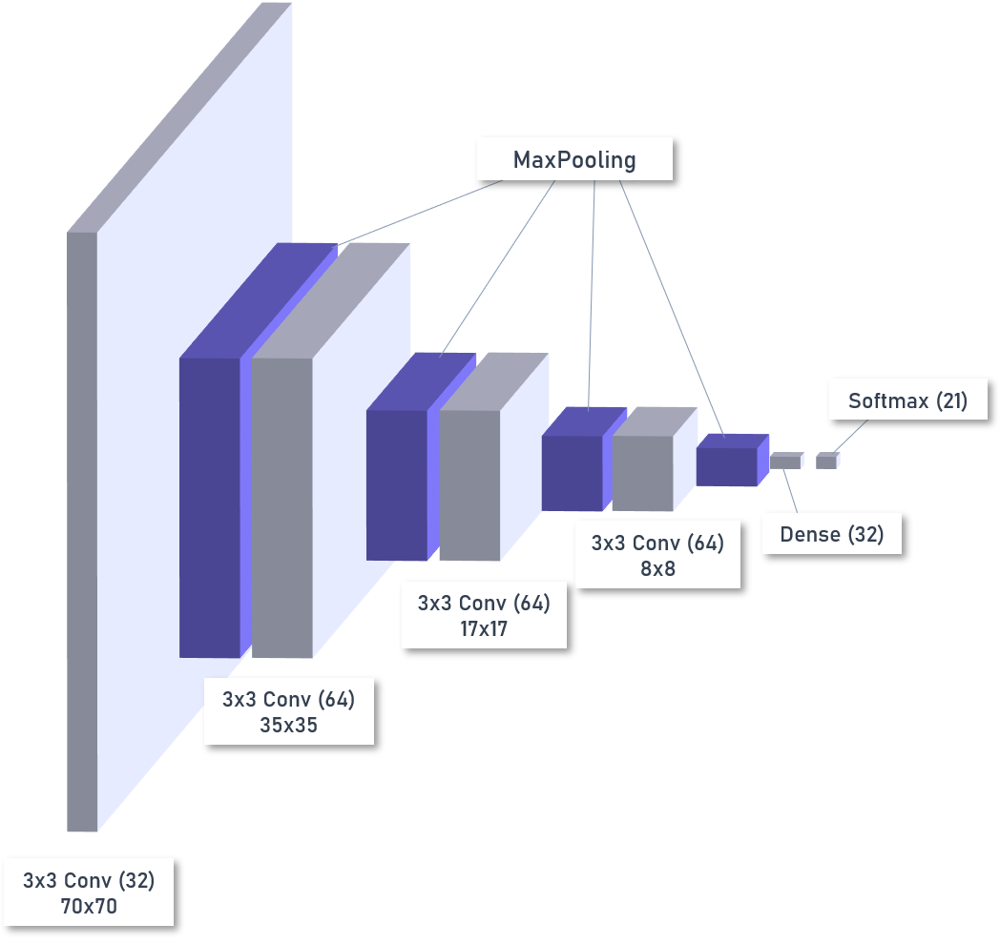
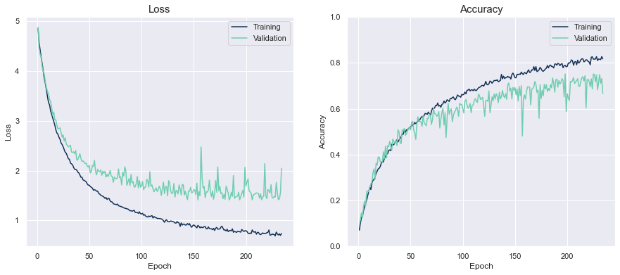
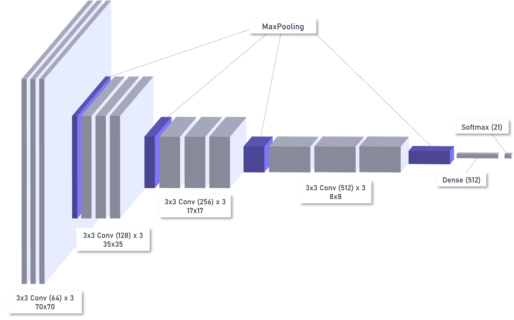

# Computer Vision for the Military
For the past few years, I’ve kept current on developments in the machine learning (ML) world through courses and interest groups. One thing I’ve noticed is that a lot of success stories were recycled from the business world. Although there are many potential military applications, especially for intelligence, these generally can’t be shared publicly due to security. Yet, there are open source datasets that can easily be repurposed for high-payoff military applications. I thought it might be useful to showcase how quickly one can develop a prototype for a problem statement of interest to the military using an open source dataset.

## Military Application: Intelligence, Surveillance, and Reconnaissance
One area of artificial intelligence (AI) that is of immense value for Intelligence, Surveillance and Reconnaissance (ISR) is **computer vision** (CV). CV greatly enhances operators' efficiency in exploiting image and video data, thereby increasing their capacity to pursue other higher-value lines of work. However. the idea of applying CV for ISR is not new. Published in 1987, [this paper](https://pdfs.semanticscholar.org/b1b9/5e3a74e6b8952bcd286393a6bd23f09a5836.pdf) proposed that AI and signal processing could be used to better understand images.

Today, many militaries are investing in CV for ISR. Some applications include recognition of military vehicles in social media[^1], recognition of camouflaged military targets[^2], battlefield object detection[^3], and person detection in military contexts[^4] to name a few. The US, China, and Russia are investing heavily in AI (with image recognition as one of the applications) to enhance their ISR capabilities.[^5] There's no reason why the RSAF shouldn't do the same. Thankfully, CV models can be developed at low cost and quickly (depending on which technology partner is chosen).

## Personal Development
As part of my personal development plan in data science, I've started work on learning to build neural networks. Since most Kaggle competitions typically involve computer vision, I decided that this would be the area that I would focus on to hone my skills in deep learning. It was nice to know that this was also related to the Air Force.

Hence, I will be writing about **aircraft recognition in remote sensing** in a series of posts. This series aims to test how well computer vision can augment human operators in aircraft recognition and hopefully, show that with some studying and practice, it's possible to create valuable technology for military applications cheaply and quickly.

# The Series
In **Part I: Building a Convolutional Neural Network (CNN) from Scratch** (this post), I detail part of my modelling process and key learning pointers.

In **Part II: (Transfer) Learning from the Best**, I start over with pre-trained models like VGG16, ResNet50 and InceptionV3 as the base and fine-tune them.

In **Part III: The Verdict**, I summarise the results, make an assessment on whether this technology is useful for operators, and propose some recommendations for the way forward in developing this capability.

1. Part I: Building a Convolutional Neural Network (CNN) from Scratch (this post)
2. Part II: (Transfer) Learning from the Best (TBC)
3. Part III: The Verdict (TBC)

# Data
For this series, I'll be using the [Multi-type Aircraft Remote Sensing Images (MTARSI) dataset](https://www.sciencedirect.com/science/article/abs/pii/S1568494620300727), which was created by Wu et al (2020). It contains 9,385 images on 20 aircraft types. It was designed to be a benchmark for aircraft recognition using CV. While some of the images were obtained from Google images, a majority of them were synthetic: they were created by superimposing aircraft on different backgrounds and performing transformations on them.

## On Synthetic Data
Although it could be argued that synthetic data may not be representative of real remote sensing images, there is no better way of obtaining enough data for models to learn. And this will always be the case for military operations data. It would be counter-intuitive to seek out more skirmishes to collect data and build better models to fight future wars better, because the first and foremost aim of a military is (or should be) deterrence, which prevents skirmishes in the first place. The point here is that synthetic data and simulation are key capabilities for building and testing AI capabilities.

## Data Quality
I cannot stress enough how important data quality is. **My biggest mistake was to take data quality for granted.** You'd think that researchers who paid experts to label data used in an academic paper would get their aircraft right. Well that sure wasn't the case.

At first, I inspected random images within the dataset, corrected a few errors, and proceeded with modelling. Halfway through, I happened to look at the images in more detail and found some atrocious labelling mistakes by the authors, who apparently employed experts to classify the aircraft. Here were some of the incorrect labels:

##### F-15s labelled as F-16s


##### F-4s, F-15s, F-16s, and F-18s labelled as F-22s


##### C-17s labelled as C-5s and vice versa


##### Boeing 737s and C-135s labelled as KC-10s


##### All aircraft with fuselage-mounted engines labelled as C-21s


##### E-2s labelled as E-3s


##### Twin-engine propeller aircraft were labelled as U-2s


##### P-3s were labelled as B-29s


##### Aircraft labelled as A-26s and P-63s (WW2 aircraft) were...not A-26s and P-63s at all




The lesson: be deliberate in ensuring that your data is clean before analysing it.

After assigning the correct labels, the dataset was left with 9,320 images distributed across 21 classes. Here's a sample of the various images:


# Evaluation Metrics and the Business Problem
Before diving into the models, it's important to define the business problem and specify appropriate metrics. Since we're testing how well a CV model can augment operators, we need to think a little about how the model will realistically be deployed.

## The Business Problem
We assume that there already is a system in place to produce images of aircraft. An operator is then required to sieve through them to tag an aircraft type and location (taken for granted here). Therefore, the CV model delivers value by making recommendations for the aircraft type, saving time and cognitive capacity.

Given that the model is sure to make mistakes, we must ensure that the man in the loop is aware of when these might occur. This can be achieved by displaying the model's confidence in each prediction (e.g. high, medium or low based on operator-defined thresholds). That way, the operator can automatically accept the recommendation for (1) classes that the model typically performs well on and (2) predictions above a certain level of confidence, while stepping in to make a call on predictions below a certain level of confidence. 

The operator is also on the lookout for certain aircraft types like high-end fighters (e.g. F-22). Therefore, the model must produce a warning flag when (a) it predicts an F-22 with a low level of confidence or (b) when it predicts aircraft that it typically confuses as F-22s (e.g. F-16).

## Appropriate Metrics
In this post, we won't do much analysis on the predicted probabilities just yet. We'll instead focus on the model's ability to make good recommendations for the aircraft in the images. Hence, I'll be using **top-1 accuracy**, **top-2 accuracy**, and **top-3 accuracy**. These measure whether the true label was in the top *n* predicted classes.

For intuitive purposes, we assume than an ISR team processes 1,500 images a day, which is about 60 per hour or 1 per minute. We also assume the following modes of model deployment:

* **Supervised autonomous tagging (man-on-the-loop):** The system automatically tags images with the top predicted class, and the operator jumps in whenever the tag is wrong. Top-1 accuracy is relevant here.
* **Semi-autonomous tagging (man-in-the-loop):** The system automatically tags images with the top predicted class **if probability is greater than 95%**. Otherwise, it presents the top 3 classes, and the operator must input the correct tag. We assume that if the top3 classes contains the true tag, there is close to no effort for the operator. Therefore, a combination of of top-1 accuracy and top-3 accuracy is relevant here.

### Sidenote on Evaluation
I think that deciding to incorporate a model purely on the model metrics is an incomplete approach because it disregards the level of autonomy with which the model will operate. If the model is meant to be used in semi-autonomous (i.e. man-in-the-loop) or supervised autonomous (i.e. man-on-the-loop), then a man better be part of the evaluation. This is because you're not just evaluating a model, you're evaluating a **man-machine team**. The metrics for this team would then be accuracy and time taken, and it should be weighed against the existing benchmark: the performance of the operator alone.

# A Convolutional Neural Network (CNN) from Scratch
In this section, I'll be sharing about (1) the first model I built, (2) the final model I built, and (3) some key learning pointers from the testing process. I assume the reader has some basic understanding of Convolutional Neural Networks (CNNs) and the types of parameters involved. This [article on Medium](https://medium.com/@himadrisankarchatterjee/a-basic-introduction-to-convolutional-neural-network-8e39019b27c4) provides a good overview.

## The First Model
I started with an extremely simple model: 4 convolutional blocks each with one convolutional layer and one max pooling layer with batch normalisation after, and a fully-connected (FC) layer with 32 nodes. My key considerations were:

1. **Start Small.** I don't have a top end GPU, so I had to be prudent with the size and complexity of the model. I also wanted the most parsimonious model possible.
2. **Experiment.** To figure out best practices in testing models, there is no shortcut - you need experience in tweaking your model, interpreting the results, and making further adjustments.

I used the following settings:

* Input size: 70x70 (found after some experimentation)
* For all convolutional layers:
    * "Same" padding
    * ReLu activation
    * Kernel size of 3x3
* For all convolutional blocks:
    * Max pooling with a pool size of 2x2
    * Batch normalisation after each max pooling layer
* For fully-connected layer:
    * Dropout of 0.5 nodes
    * ReLu activation
* Compiling the model:
    * Loss: Categorical crossentropy (a standard loss metric)
    * Optimiser: Adam with a learning rate of 0.0001 (found after some experimentation)
* Fitting:
    * Batch size of 16 (found after some experimentation)
    * Early stopping with a patience of 50 epochs (found after some experimentation)

### Model Architecture
See below for the model summary and a diagram of the architecture:

```
_________________________________________________________________
Layer (type)                 Output Shape              Param #   
=================================================================
conv2d_8 (Conv2D)            (None, 70, 70, 32)        896       
_________________________________________________________________
max_pooling2d_8 (MaxPooling2 (None, 35, 35, 32)        0         
_________________________________________________________________
batch_normalization_8 (Batch (None, 35, 35, 32)        128       
_________________________________________________________________
conv2d_9 (Conv2D)            (None, 35, 35, 64)        18496     
_________________________________________________________________
max_pooling2d_9 (MaxPooling2 (None, 17, 17, 64)        0         
_________________________________________________________________
batch_normalization_9 (Batch (None, 17, 17, 64)        256       
_________________________________________________________________
conv2d_10 (Conv2D)           (None, 17, 17, 64)        36928     
_________________________________________________________________
max_pooling2d_10 (MaxPooling (None, 8, 8, 64)          0         
_________________________________________________________________
batch_normalization_10 (Batc (None, 8, 8, 64)          256       
_________________________________________________________________
conv2d_11 (Conv2D)           (None, 8, 8, 64)          36928     
_________________________________________________________________
max_pooling2d_11 (MaxPooling (None, 4, 4, 64)          0         
_________________________________________________________________
batch_normalization_11 (Batc (None, 4, 4, 64)          256       
_________________________________________________________________
flatten_2 (Flatten)          (None, 1024)              0         
_________________________________________________________________
dense_4 (Dense)              (None, 32)                32800     
_________________________________________________________________
dense_5 (Dense)              (None, 21)                693       
=================================================================
Total params: 127,637
Trainable params: 127,189
Non-trainable params: 448
_________________________________________________________________
```



### Choosing the Best Weights
The best set of model weights was chosen based on **validation loss**. This is because accuracy isn't exactly the best metric to choose. Let's break it down. Take for example two scenarios:

1. The model predicts an image has an F-15 with 90% probability (and 0.5% each for the remaining 20 classes)
2. The model predicts an image has an F-15 with 20% probability (and 4% each for the remaining 20 classes)

Which scenario would you rather have more of? Surely it's scenario 1. This is because accuracy says little about a model's **confidence** in predicting a given class.Accuracy is computed using thresholded values: if the output probability for a given aircraft type is the highest among all other class probabilities, you set the predicted class for that aircraft type to 1, and 0 for all other aircraft types.

On the other hand, categorical crossentropy penalises the model when it gives you a high probability that the aircraft in an image belongs to a certain class *when it actually doesn't*. That ensures that the model aims to be right with some degree of confidence. Hence, the best weights for all models I developed were chosen using validation loss.

### Results of First Model

#### Accuracy
First, we see that accuracy (I'll refer to top-1 accuracy as "accuracy") was 68%, while top-2 and top-3 accuracy were at 82% and 89% respectively. 




Based on our defined metrics for a man-machine team operating on supervised autonomous and semi-autonomous tagging:

* **Supervised autonomous:** The system would attain 68% accuracy, and the operator would have to manually tag 32% or 20 of 60 images per hour.
* **Semi-autonomous:**
    * The man-machine team would attain an accuracy of 88%:
        * Automated tags that were correct: 27%
        * Recommended tags that were correct: 61% (we assume this is not manual tagging)
    * The operator would have to manually tag 12% or about 8 of 60 images per hour


#### Accuracy by Class
Second, we look at the aircraft types that the model performed well on. The results seem fairly intuitive. The B-2, E-3, and T-6 all have very unique features. F-18s are in the top few probably because of the lack of variety in images. Light aircraft stand out fairly well because of their clumsy, squarish shape.


#### Confusion Matrix
Third, to understand the poor performance on some classes, we need to inspect the confusion matrix. True enough, we note some confusion here.


Here are some of the more notable mix-ups:

* Boeings (civilian airliners) were confused with B-52s, E-3s and Private Jets
* C-130s were confused with C-135s and C-17s
* C-5s were confused with C-130s and C-135s
* F-15s were confused with F-16s, but not the other way round
* **Strangely, F-16s were confused with B-52s**
* F-22s were badly confused with F-16s, but not the other way round
* Private Jets were confused with Twin Turboprops, Light Aircraft, and Boeings
* Twin Turboprops were confused with Boeings

In this list, the most dangerous mix-up is in bold. Since fighters are faster and more lethal, an ISR operator probably wouldn't want to have F-16s labelled as a more benign aircraft type.

#### Class Probabilities
Fourth, we need an assessment of how confident the model was when it made predictions. Ideally, the model should output high probabilities when it is correct, and low probabilities when it is wrong. We use two types of plots to make this assessment: (1) a bar plot of the mean predicted probability grouped by whether the prediction was correct or not, and (2) density plots for the distribution of predicted probabilities. The bar plot is an overview of differences in distribution, while the histograms show us the exact difference in distribution.

Generally, we see lower differentiation in the distributions of predicted probabilities for aircraft types that the model performed relatively poorly on: Boeing, C-130, C-135, C-5, F-15, F-22, Private Jet, and Twin Turboprop.


### Evaluation
Overall, the model is certainly not performing well enough for deployment in supervised autonomous mode. However, it might be possible to save the ISR operator a little bit of time if operated in semi-autonomous mode.

As a sidenote, it's interesting to note that the model would probably perform better than someone who is completely untrained in aircraft recognition. Logically, an untrained person could use a simple heuristic to categorise aircraft:

* Transport aircraft: Big aircraft with wide wingspan that look like they can carry lots of things
* Light aircraft: Relatively small and harmless/clumsy-looking.
* Fighter aircraft: Relatively small, sharp, and fierce-looking.
* Other: Only the A-10 can't be fit into any of the above categories. It is a hybrid of light aircraft and transport aircraft.

Assuming he guesses the most prevalent class from each category (C-130 for transport aircraft, anything squarish as light aircraft, F-15 for fighters, and the A-10 for others), he would get an accuracy of **25-30%**. In comparison, the model hit an accuracy of **68%**.

## The Final Model
I'm skipping ahead to the exciting bit: the final model. I'll explain some of the tweaks I made in the next section on the fine-tuning process.

### Model Architecture
The final model was much more complex with 12 million parameters across 13 weight layers. See below for the model summary and a diagram of the architecture:

```
_________________________________________________________________
Layer (type)                 Output Shape              Param #   
=================================================================
conv2d (Conv2D)              (None, 70, 70, 64)        1792      
_________________________________________________________________
conv2d_1 (Conv2D)            (None, 70, 70, 64)        36928     
_________________________________________________________________
conv2d_2 (Conv2D)            (None, 70, 70, 64)        36928     
_________________________________________________________________
max_pooling2d (MaxPooling2D) (None, 35, 35, 64)        0         
_________________________________________________________________
batch_normalization (BatchNo (None, 35, 35, 64)        256       
_________________________________________________________________
conv2d_3 (Conv2D)            (None, 35, 35, 128)       73856     
_________________________________________________________________
conv2d_4 (Conv2D)            (None, 35, 35, 128)       147584    
_________________________________________________________________
conv2d_5 (Conv2D)            (None, 35, 35, 128)       147584    
_________________________________________________________________
max_pooling2d_1 (MaxPooling2 (None, 17, 17, 128)       0         
_________________________________________________________________
batch_normalization_1 (Batch (None, 17, 17, 128)       512       
_________________________________________________________________
conv2d_6 (Conv2D)            (None, 17, 17, 256)       295168    
_________________________________________________________________
conv2d_7 (Conv2D)            (None, 17, 17, 256)       590080    
_________________________________________________________________
conv2d_8 (Conv2D)            (None, 17, 17, 256)       590080    
_________________________________________________________________
max_pooling2d_2 (MaxPooling2 (None, 8, 8, 256)         0         
_________________________________________________________________
batch_normalization_2 (Batch (None, 8, 8, 256)         1024      
_________________________________________________________________
conv2d_9 (Conv2D)            (None, 8, 8, 512)         1180160   
_________________________________________________________________
conv2d_10 (Conv2D)           (None, 8, 8, 512)         2359808   
_________________________________________________________________
conv2d_11 (Conv2D)           (None, 8, 8, 512)         2359808   
_________________________________________________________________
max_pooling2d_3 (MaxPooling2 (None, 4, 4, 512)         0         
_________________________________________________________________
batch_normalization_3 (Batch (None, 4, 4, 512)         2048      
_________________________________________________________________
flatten (Flatten)            (None, 8192)              0         
_________________________________________________________________
dense (Dense)                (None, 512)               4194816   
_________________________________________________________________
dense_1 (Dense)              (None, 21)                10773     
=================================================================
Total params: 12,029,205
Trainable params: 12,027,285
Non-trainable params: 1,920
_________________________________________________________________
```



### Results of the Final Model

#### Accuracy
First, we see that all metrics improved substantially:


Based on our defined metrics for a man-machine team operating on supervised autonomous and semi-autonomous tagging:

* **Supervised autonomous:** The system would attain 86% accuracy, and the operator would have to manually tag 14% or about 9 of 60 images per hour.
* **Semi-autonomous:**
    * The man-machine team would attain an accuracy of 95%:
        * Automated tags that were correct: 65%
        * Recommended tags that were correct: 30%
    * The operator would have to manually tag 5% or 3 of 60 images per hour


#### Accuracy by Class
Second, we see that class accuracy has improved across the board, especially on aircraft types that did not perform as well before. More work could be done and more data could be added for the F-15, F-22, and C-5, which still have low accuracy.


#### Confusion Matrix
Third, we inspect the confusion matrix to check for improvements in the "confusions". In general, the fighters are confused with one another, and likewise for transport aircraft. We no longer have the issue of confusing fighters with transport aircraft.

* Boeings (civilian airliners) are now instead confused with C-135s and Twin Turboprops
* C-130s are now only confused with C-135s (and not C-17s)
* C-5s are still confused with C-130s and C-135s
* F-15s are still confused with F-16s, but not the other way round
* **F-16s are no longer confused with B-52s**
* F-22s are still confused with F-16s, and now F-18s too
* Twin Turboprops are still confused with Boeings


#### Class Probabilities
We see some improvements in the differentiation in distributions of predicted probabilities for aircraft types that the model performed relatively poorly on: Boeing, C-130, C-135, C-5, F-15, F-22, Private Jet, and Twin Turboprop. The F-22 remains the aircraft type that needs the most work.

Separately, note that in the bar plot (first chart), the mean value for correctly and incorrectly predicted probabilities for A-10 was almost identical. This was because there was exactly one confident but incorrect prediction that a C-130 was an A-10.


### Evaluation
Overall, the model has improved significantly from the first simple model. It has the potential to save the operator time and brain power in identifying aircraft from images. We'll discuss this a little more in the conclusion.

## The Fine-Tuning Process
I saved the less exciting bits for the last. Here are some of the things I learned from building a CNN from scratch.

#### 1. Modelling vs. neural network training
I observed that two interesting parallels between the training of individual NNs and the overarching modelling process.

##### A. Batch size
At first, I lined up a few architectures that I wanted to test, and ran them overnight. However, I realised that some of the architectures attained pretty bad results, probably because I was just trying my luck. This was equivalent to batch training (no minibatch gradient updates): updating my understanding of the model after one batch of models returned results. After a while, I switched over to a one-model-at-a-time approach. Interpreting the results was fast and targeted. I made more improvements in this way. This was equivalent to training with minibatches, where a model updates its weights (understanding of what works) at shorter intervals.

##### B. Adaptive learning rates
Initially, I made very minor adjustments to my model, like adding one convolutional layer in one of the blocks at a time. At that point, I was concerned about randomness in the results (there are [many sources](https://machinelearningmastery.com/randomness-in-machine-learning/)), and went to the extent of doing 5 repeats for each configuration. Progress was extremely slow.

After some time, I switched to a more adaptive approach. When I made changes, I made **big** changes at first to find big improvements, and I did. Even with randomness, the results from the improved models would not have overlapped with the results from the older models, so I ran each configuration just once. As the model got closer to hitting its limits, I scaled back on the size of the changes. This was akin to an adaptive learning rate: faster at first to make the easy improvements and slower later on to find the elusive global minimum.

#### 2. Make small, iterative improvements
I built my model using [Andrew Ng's panda approach](https://www.coursera.org/lecture/deep-neural-network/hyperparameters-tuning-in-practice-pandas-vs-caviar-DHNcc): I made small adjustments to gradually improve it. I tracked the learning curves for loss and accuracy, and analysed these to make adjustments. Sometimes, I monitored the training and validation loss as training was going on to see if there were potential issues with the parameters, and could stop training halfway to tweak them.

#### 3. Choose your evaluation tools carefully
Be clear on what you want to evaluate before building models. The graphs above only came to mind after I was halfway through the modelling process when validation accuracy for one of my models was stuck at a pretty low level. When I realised that this accuracy level coincided with the relative frequency for the Boeing class. But I had no way to confirm that until I re-wrote my scripts to include the confusion matrix and class accuracy table. 

# Conclusion [TL;DR]
In this pretty lengthy post, I introduced the business problem of using computer vision for aircraft recognition, presented my initial and final models, and shared some learning pointers for fine tuning a neural network. Returning to our original question of how well this model can augment ISR operators in aircraft recognition, we consider the amount of manual processing that an operator might need to perform. In the final model:

* **Supervised autonomous tagging (man-on-the-loop):**
    * The system automatically tags 86% of the images correctly
    * The operator would have to manually tag 14% or about 9 of 60 images per hour
* **Semi-autonomous tagging (man-in-the-loop):**
    * With a probability threshold, the system automatically tags 65% of the images  correctly
    * For images below the threshold, the system recommends 30% of the images correctly
    * The operator would have to manually tag 5% or 3 of 60 images per hour

Although the models produced some decent results, we still can't make an assessment on whether the model should be incorporated. We need more information about how things are done - questions that only the ops users can answer. For example:

* What accuracy threshold is required?
* How quickly do you need the results?
* Are there other higher value tasks that the operator should be freed up for? 

If there are a few things that we've shown (also the things to take away), these are that:

1. **Computer vision technology is relevant for the military.** We don't see many open case studies - hopefully this series of posts will serve as one.
2. **Computer vision technology is readily available.** It's cheap (effectively free), and it can be done relatively quickly if you have people with the right technical expertise and domain knowledge.

<hr>

### Sources

[^1]: [Recognizing Military Vehicles in Social Media Images Using Deep Learning - Hiippala (2017)](https://www.mv.helsinki.fi/home/thiippal/publications/2017-ieee-isi.pdf)
[^2]: [Automatic Detection of Military Targets Utilising Neural Networks and Scale Space Analysis - Khashman (2000)](https://apps.dtic.mil/dtic/tr/fulltext/u2/p010890.pdf)
[^3]: [Multi-Channel CNN-based Object Detection for Enhanced Situational Awareness](https://www.sto.nato.int/publications/STO%20Meeting%20Proceedings/STO-MP-SET-241/MP-SET-241-9-5.pdf)
[^4]: [Detection of People in Military and Security Context Imagery - Shannon et al (2014)](https://www.spiedigitallibrary.org/conference-proceedings-of-spie/9248/92480N/Detection-of-people-in-military-and-security-context-imagery-withdrawal/10.1117/12.2069906.full?SSO=1)
[^5]: [Military Applications of Artificial Intelligence - RAND Corporation (2020)](https://www.rand.org/pubs/research_reports/RR3139-1.html)