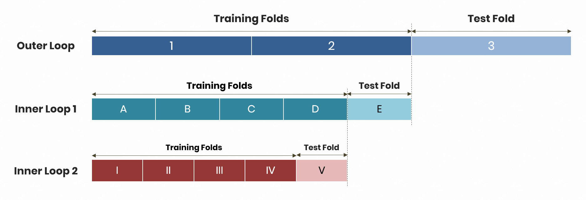

# Cross Validation Strategy
In my previous post, I wrote about a pipeline to tie feature engineering, hyperparameter tuning, and prediction together as as process that converts semi-processed data into predictions. I also mentioned the term "cross validation" on numerous occasions, only hinting that it was a technique to evaluate many things: encoding schemes, hyperparameters and prediction accuracy. In this post, I explain what cross validation is, as well as the cross validation strategy that I used for my model. This strategy is highly-applicable and useful to other pipelines with stacked models because it ensures minimal information leakage in the testing process.  

# What is Cross Validation?
Cross validation is a technique that enables you to make full use of your dataset by repeating samples as training data and test data. It requires us to specify *X* observations as training observations to fit models too, and the remaining *N - X* observations as test observations to evaluate models on. The versions of cross validation that I explain in this post are ***K*-fold cross validation** and **nested cross validation**.  
  
## *K*-Fold Cross Validation
As the name suggests, *K*-fold cross validation is about splitting the data into *K* folds, and rotating each fold as the test set. Let's use `K = 5` as an example. If we have a dataset with 1,000 observations, we could split it as such:  
  
| Fold |   Row IDs   |
|:----:|:-----------:|
|   1  |   1 to 200  |
|   2  |  201 to 400 |
|   3  |  401 to 600 |
|   4  |  601 to 800 |
|   5  | 801 to 1000 |
  
The idea is to create 5 equal partitions. In reality, we would select the "row IDs" at random to ensure that the ordering of rows does not affect our estimate of accuracy. Now, 5 folds allow us to test a model 5 times by rotating each fold as the test set:  
  
| Iteration | Test Fold | Training Folds |
|:---------:|:---------:|:--------------:|
|     1     |     1     |   2, 3, 4, 5   |
|     2     |     2     |   1, 3, 4, 5   |
|     3     |     3     |   1, 2, 4, 5   |
|     4     |     4     |   1, 2, 3, 5   |
|     5     |     5     |   1, 2, 3, 4   |
  
For example, in Iteration 1, we would fit the data to the combined dataset formed by Folds 2 to 5, make predictions on Fold 1, and evaluate the predictions. By evaluate them, I mean comparing predictions to the true values of the target feature. Hence, we get a set of 5 accuracy scores, which we can average to get an estimate of model accuracy. However, 5 accuracy scores is certainly not representative of the true distribution of model accuracy. Hence, it is important to obtain more estimates. To do this, we turn to **repeated** *K*-fold cross validation.  
  
### Improving the Estimate of Model Accuracy
Recall that in practice, we establish the folds at random. That is, we would not be getting such nice partitions in order of the row IDs. Instead, we would get random rows in each fold. Repeated *K*-fold cross validation essentially repeats *K*-fold cross validation, each time with a different partition of folds. If we did 3 repeats of 5-fold cross validation, we would get 15 accuracy scores (or 3 sets of 5 accuracy scores). That brings us closer to getting a more reliable estimate of the accuracy. The more repeats, the better, but the more computationally expensive the process would be.  
  
## Nested Cross Validation (CV)
While repeated *K*-fold cross validation does a nice job of giving us model accuracy, it is insufficient. Suppose once again that we split our 1,000-sample dataset randomly into 5 folds. We use these 5 folds to obtain the best encoding schemes and hyperparameter combinations for each model. Then, we use **the same 5 folds to estimate model accuracy**. How accurate is this estimate?  
  
### Analogy I: Overfitting to Exams
Let's use an analogy in education: an 'A' level exam for an arbitrary subject [although any exam with preliminary exams (prelims) would be equally analogous]. Suppose we have to take three exams: a mock prelim, a prelim, and the actual 'A' level exam. We study really hard, and end up doing badly for the mock prelim (at least I did when I was in JC). This would enable us to identify and focus on our weak areas to prepare well. In the prelim, the paper turned out to be extremely similar to the mock prelim! The questions were simply minor variations of the questions in the mock prelim. Hence, we do extremely well. Now, here's the key question: how do you think we would do on the actual 'A' level exam?
  
We don't know! But, what we do know is that we would not do as well as we did on the prelim. Why? Because we effectively optimised our studies and practice for the prelim as opposed to a more broad-based approach to prepare for multiple topics in the subject.  
  
Using the same folds for testing encoding schemes, hyperparameter tuning, **and estimating model accuracy** is akin to having identical questions for a mock prelim and a prelim. The model ends up preparing to do well only for certain types of training samples, thereby inflating our estimate of the model's performance on unseen data.  
  
### Analogy II: Studying Smart
Extending the analogy above, let's say that the mock prelim and prelim covered different areas within the same topics, while the 'A' level exam comprised a variation of questions from the mock prelim and prelim. Having done badly in the mock prelim (again), we would once again focus on our weak areas. In the prelim, we wouldn't do as well as in Analogy I, but we would uncover *more weak areas* to work on. Before the actual 'A' level exam, we would have covered substantial ground without preparing too in-depth for specific topics.  
  
The same goes for cross validation. Suppose we have 5 folds. In our first iteration, we use Folds 2, 3, 4, 5 (let's call this Set 1) as the training set. Now, we split Set 1 into a further 5 folds (A to E). In this *inner loop*, we perform 5 iterations as explained earlier (e.g. Iteration 1: Train on B, C, D, E and predict on A) to select the best encoding schemes and hyperparameters for a given model. This is equivalent to practicing on the mock prelim. Then, using the optimal settings, in the *outer loop*, we perform a prediction on Fold 1, which represents sitting for the prelim to uncover more weak areas.  
  
At this point, a student would focus on covering more ground; a modeller would re-adjust features or attempt different algorithms to improve the out-of-sample accuracy from cross validation. This strategy gives us a more robust estimate of model accuracy, just as it would give a student a better indication of his/her preparedness for the actual 'A' level exam. This strategy is called nested cross validation.  
  
## Double Nested Cross Validation
We are entering Inception territory here. In the previous section, I explained how you can embed a cross validation loop (*inner loop*) within another (*outer loop*). Out of necessity (because I am developing a stacked regression model), I need to embed *yet another* cross validation loop within the existing structure. Why?
  
### Stacked Models
Stacked models have two levels of prediction: (1) the first-layer base models and (2) the second-layer meta model(s), which I shortlisted the simplistic OLS regression for (no parameters to optimise). Thus, we effectively need **nested cross validation** to optimise the first-layer base models and obtain a robust estimate of their generalisation ability, and **normal cross validation** to evaluate the second-layer meta model. Let's consider the case where we use only nested cross validation to evaluate the entire stacked model.  
  
Typically, modellers use the following strategy:  
  
1. Split the data into 5 folds (Folds 1 to 5)
2. For a given iteration (say Fold 1 as the testing fold), specify Fold 1 as the test fold, and Folds 2 to 5 as the training fold (call it A)
3. Split A into 5 folds
4. Run cross validation on the 5 folds of A to optimise encoding schemes and tune hyperparameters
5. Fit the data to Folds 2 to 5, and save the predictions on Fold 1 in a separate dataset (X)
6. Repeat for the other iterations (Fold 2, 3, 4, and 5) to get a *full dataset* of predictions (dataset X)
7. Using the same folds (Folds 1 to 5), run cross validation on the meta model to get an estimate of model accuracy
  
Here's the implicit problem: In step 7, by using the same folds, we would be introducing leakage into the model. The predictions for Fold 1 were derived from the processed data in Folds 2 to 5, the predictions for Fold 2 were derived from the processed data in Folds 1, 3, 4, and 5, and so on. When we fit the predictions from **Folds 2 to 5** to predict the target feature values in Fold 1, we are therefore using *some* information from the target feature values in Fold 1. This is because the predictions from **Folds 2 to 5** were derived in part from the target feature in Fold 1 in steps 1 to 6. Thus, this strategy will give biased estimates of model accuracy.  
  
Therefore, it is essential that we have double (or possibly triple) nested cross validation to get a robust estimate of the stacked model's accuracy. How do we achieve that?  
  
## My Approach

  

  
